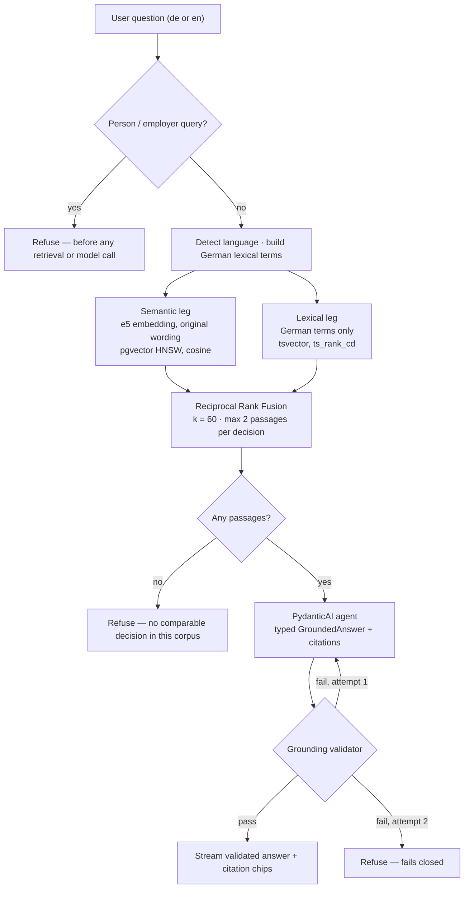

# Architecture

How Judges Said turns a plain-language question into cited German case law, and why each part
works the way it does. Decisions recorded here are settled — the rationale is kept next to the
design so it does not get re-litigated.

---

## One turn, end to end



Three properties of this flow are deliberate:

1. **Retrieval runs once per turn.** Switching answer language re-renders the prose from the
   *stored* citations. Re-running retrieval could return different case law for the German and
   English versions of the same answer, which would destroy trust.
2. **The answer is generated in full before anything is sent.** Token-by-token streaming is
   incompatible with the grounding contract — the validator needs the complete text, and a
   prediction cannot be un-sent once a user has read it. The endpoint still streams; it streams
   the *validated* text, so the UI behaves like a chat either way.
3. **It fails closed.** An answer that never validated is never returned.

---

## Why the two retrieval legs get different inputs

This is the crux of the bilingual feature.

- The **semantic** leg embeds the user's **original** words. Multilingual e5 already aligns
  English and German, so an embedding of *"fired while on sick leave"* lands near German passages
  about `Kündigung während Arbeitsunfähigkeit`. No translation needed.
- The **lexical** leg cannot work that way. A `german`-config `tsvector` will never match the
  token `dismissal`, so an English query makes full-text search contribute nothing and RRF
  silently degrades to semantic-only.

So English queries are translated to German **for the lexical leg only**, via a labour-law
glossary in [query_language.py](../backend/app/retrieval/query_language.py) — deterministic, free,
zero latency, and incapable of hallucinating a statute. The translated query is returned in the
response payload so an English speaker with thin results can see that *"notice period"* became
`Kündigungsfrist`.

Two measured findings shaped the lexical leg, both documented in that module:

- `plainto_tsquery` and `websearch_to_tsquery` **AND** their terms together, so every word of a
  question had to appear in one 350-token chunk. Measured: zero rows for nine of ten realistic
  questions, which meant the lexical leg contributed nothing and RRF quietly became
  semantic-only. Terms are OR-ed instead, and `ts_rank_cd` does the ranking — a chunk matching
  more of the query simply ranks higher.
- Falling back to raw English text when the glossary had no match produced English tokens matched
  against a German tsvector — noise dressed as a retrieval leg. The leg is now skipped entirely
  instead, and RRF honestly degrades to semantic-only.

### Fusion

The two legs produce incomparable numbers — cosine similarity is bounded, `ts_rank_cd` is not —
so their scores cannot be added or averaged. Reciprocal Rank Fusion ignores scores and uses only
ranks, which is what makes it work across legs of different kinds:

```
score(d) = Σ  1 / (k + rank_leg(d))        k = 60
```

Each leg returns 40 candidates so RRF has enough of each tail to find agreement. At most **two
passages per decision** survive into the final set — without that cap, one long on-topic judgment
fills the whole answer and the user sees one case instead of the three to five analogous ones the
product promises.

---

## The grounding validator is the compliance control

[grounding/validator.py](../backend/app/grounding/validator.py) is deterministic, LLM-free, and
testable. A model told not to predict outcomes will still do it occasionally; this module is what
makes that a *rejected* answer rather than a shipped one.

| Rejection | Trigger |
| --- | --- |
| `PREDICTION` | Outcome-prediction language, German or English (`Erfolgsaussichten`, `you will win`, `the court will rule in your favour`, `70 % Wahrscheinlichkeit`, …) |
| `QUOTE_NOT_IN_SOURCE` | A quoted passage is not verbatim in the German source text |
| `UNRETRIEVED_CITATION` | A cited chunk was not retrieved this turn |
| `NO_CITATIONS` | An answer with no citations that is not the explicit "no comparable case" refusal |
| `PERSON_QUERY` | Aggregate person/employer search, checked *before* retrieval |

Quotes are validated against the **German** source regardless of answer language. Translating
before validating would compare a paraphrase to a source and pass anything.

The prediction patterns are deliberately broad: a false positive costs one regenerated answer, a
false negative is an unlicensed legal service.

---

## Backend layout

```text
backend/app/
├── main.py                  FastAPI app, CORS, /health, /me
├── config.py                the only place the environment is read
├── auth/                    Supabase JWT verification
├── chat/
│   ├── router.py            thread CRUD, SSE chat endpoint, statute lookup
│   ├── orchestrator.py      one turn: refuse → retrieve → answer → validate → retry
│   ├── relanguage.py        re-render an answer from its stored citations
│   ├── streaming.py         Vercel AI SDK UI message stream, written by hand
│   └── titles.py            thread titles from the first question
├── retrieval/
│   ├── retriever.py         drives both legs, applies per-decision caps
│   ├── search.py            the two legs as SQL (pgvector + tsvector)
│   ├── fusion.py            Reciprocal Rank Fusion
│   ├── query_language.py    language detection + German glossary
│   └── statutes.py          § lookup for citation chips
├── assistant/
│   ├── agent.py             PydanticAI agent, 4 bounded tools
│   └── instructions.md      the product contract, reviewable on its own
├── grounding/validator.py   the compliance control
├── ingestion/
│   ├── normalize.py         Open Legal Data HTML → Markdown, sections preserved
│   ├── chunking.py          350 tokens / 50 overlap, never across a section boundary
│   ├── embeddings.py        local e5, with the required query:/passage: prefixes
│   └── pii.py               residual identifier redaction
└── database/models/         SQLAlchemy models + shared constants
```

The agent never writes SQL and never picks a table. It has four tools — search again, re-read a
retrieved chunk, read that chunk's neighbours, look up a statute — and everything it can reach is
something retrieval already decided it may see.

Retrieval uses direct SQL through SQLAlchemy rather than Supabase RPCs. The RPC indirection exists
so a *browser* can run a vector search through PostgREST, whose filter DSL cannot express
`embedding <=> query_vector`. Nothing here runs in a browser — the backend owns retrieval — so an
RPC would add a deployment artefact and a round trip for no benefit.

---

## Data model

Court decisions and statute sections live in **one** table, separated by `doc_kind`, so retrieval
can rank them together.

**`source_documents`** — `doc_kind` (`case` | `law`), `court_name`, `court_id`,
`court_jurisdiction`, `decision_type`, `decision_date`, `decision_year`, `file_number` (the
Aktenzeichen), `ecli`, `source_url`, `markdown_content`, `norm_refs` (JSONB, the case↔statute
join), `book_code`, `revision_date`, `is_latest`, `license_note`.

**`document_chunks`** — `section`, `paragraph_number` (Randnummer), `text`,
`embedding vector(768)`, and `text_search` as a `tsvector` **generated in Postgres** so it can
never drift from `text`.

There is deliberately **no `page` column**. German decisions have named structural sections —
`Tenor`, `Leitsatz`, `Tatbestand`, `Entscheidungsgründe` — which always exist and are what a
reader can actually find. A page number would be a citation that degrades to section-only anyway.

Indexes: HNSW (`vector_cosine_ops`) on the embedding, GIN on the tsvector, GIN on `norm_refs`,
plus composite indexes on `(court_name, decision_year)` and `(book_code, file_number)`.

Citations are persisted in their own `message_citations` table rather than inline in the message,
so chips survive a reload and the evidence can actually be queried.

### Two constants that cannot drift

In [constants.py](../backend/app/database/models/constants.py):

- **`EMBEDDING_DIMENSIONS = 768`.** Changing the model means an Alembic migration that alters the
  column and rebuilds the HNSW index.
- **`FTS_CONFIG = "german"`.** German stemming and compound splitting are the entire reason the
  lexical leg finds anything.

e5 requires the `query: ` and `passage: ` input prefixes and **degrades silently** without them.
That asymmetry is also what makes an English question match a German passage, so it is not a
formatting detail.

---

## Bilingual behaviour

Users may ask in **English or German**, and read the answer in **either language**, independently
of the language they asked in. The corpus itself is German-only and stays German — that is not a
limitation to work around, it is the evidence.

- `answer_language` is **explicit** in the request, defaulted to the detected query language and
  then overridable per thread. Someone may well ask in English and want the German wording to show
  their employer.
- Switching answer language **does not re-run retrieval**. Same evidence, different prose.
- **Evidence is never translated.** Court names, Aktenzeichen, ECLI, dates, and § references are
  rendered verbatim in German in both answer languages — the user may need to type them into a
  court portal or quote them to a lawyer. Quoted passages are stored and displayed in the original
  German.
- An English answer may *summarize* a passage, and may offer a clearly-labelled unofficial
  translation **alongside** the original. It may never replace it. A translated quote is a
  paraphrase presented as evidence, which is the exact failure mode the grounding contract exists
  to prevent.

---

## API

Every route except `/health` requires a Supabase-verified JWT, checked before any retrieval or LLM
work happens. Identity comes from the token and nowhere else — never from a request body or query
parameter. Threads are user-scoped, and the distinction is deliberate: 404 for a thread that does
not exist, 403 for someone else's.

| Method | Route | Purpose |
| --- | --- | --- |
| `GET` | `/health` | Liveness (unauthenticated) |
| `GET` | `/me` | Identity as the server sees it |
| `GET` | `/threads` | List the caller's threads |
| `POST` | `/threads` | Create a thread |
| `DELETE` | `/threads/{id}` | Delete a thread |
| `GET` | `/threads/{id}/messages` | Messages with their stored citations |
| `POST` | `/chat/stream` | Ask a question — SSE, returns `X-Thread-Id` |
| `POST` | `/messages/{id}/language` | Re-render one answer in the other language |
| `GET` | `/statutes/{book}/{section}` | § text for a citation chip |

`/chat/stream` emits Vercel AI SDK UI message stream events: a `status` data event per real stage
(`retrieving`, `reading`, `validating`, `revising`), then a `citations` data event, then the answer
text. Stages reported are only ones that actually happen — no fixed timeline, nothing faked for
effect.

---

## Configuration

One settings module per service is the source of truth:
[backend/app/config.py](../backend/app/config.py) and
[frontend/src/lib/env.ts](../frontend/src/lib/env.ts). No `os.getenv` in app code, no
`load_dotenv` anywhere, no `process.env` outside `env.ts`. Missing required config **fails on
startup** rather than surfacing later as a confusing request-time error.

**Backend** (`backend/.env`)

| Variable | Notes |
| --- | --- |
| `SUPABASE_URL`, `SUPABASE_ANON_KEY` | Project API settings |
| `SUPABASE_SERVICE_ROLE_KEY` | Bypasses RLS — ingestion only, never on a user request path |
| `DATABASE_URL` | Direct connection, port 5432 |
| `OPENAI_API_KEY` | |
| `OPENAI_CHAT_MODEL` | Answer generation |
| `OPENAI_TRANSLATION_MODEL` | Cheapest tier, used for thread titles — query translation is a glossary, not an LLM call |
| `ALLOWED_ORIGINS` | JSON list, e.g. `["http://localhost:5173"]` |

**Frontend** (`frontend/.env`) — `VITE_API_BASE_URL`, `VITE_SUPABASE_URL`,
`VITE_SUPABASE_ANON_KEY`. Vite inlines these at **build** time, not runtime, so they must be set
before the build. Anon key only; the service-role key must never reach a browser.

---

## Engineering conventions

- **Default: write it yourself.** A dependency is justified only when the alternative is
  non-trivial or error-prone — HTTP clients, ASGI servers, SQL drivers, parsers, LLM SDKs, ORM,
  migrations, auth. Not helpers wrapping 20 lines of stdlib. The SSE envelope is hand-written for
  exactly this reason: it is a handful of JSON objects with one consumer.
- **Small, obvious functions.** A 15-line function with clear names beats a three-class
  abstraction. Extract on the third caller, not a hypothetical one.
- **Validate at boundaries only** — HTTP input, external APIs, DB writes, untrusted parsing. No
  error handling for cases that cannot happen.
- **Comments explain why, never what.** The measured findings behind the retrieval design live
  next to the code they justify.
- No backwards-compat shims, no speculative feature flags.
